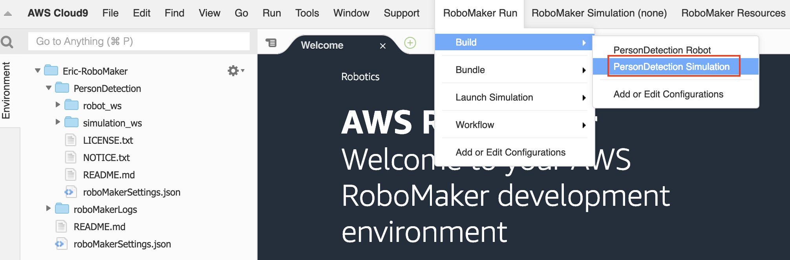
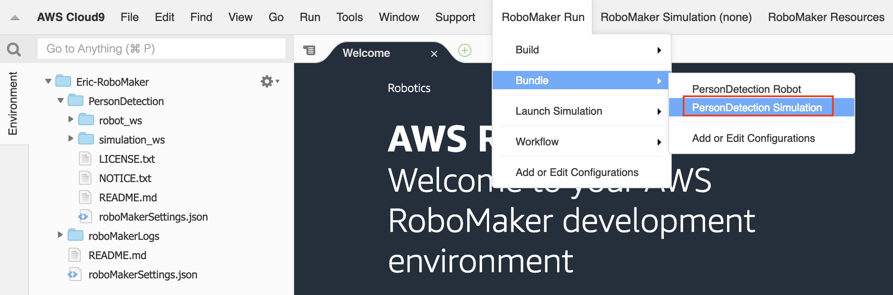
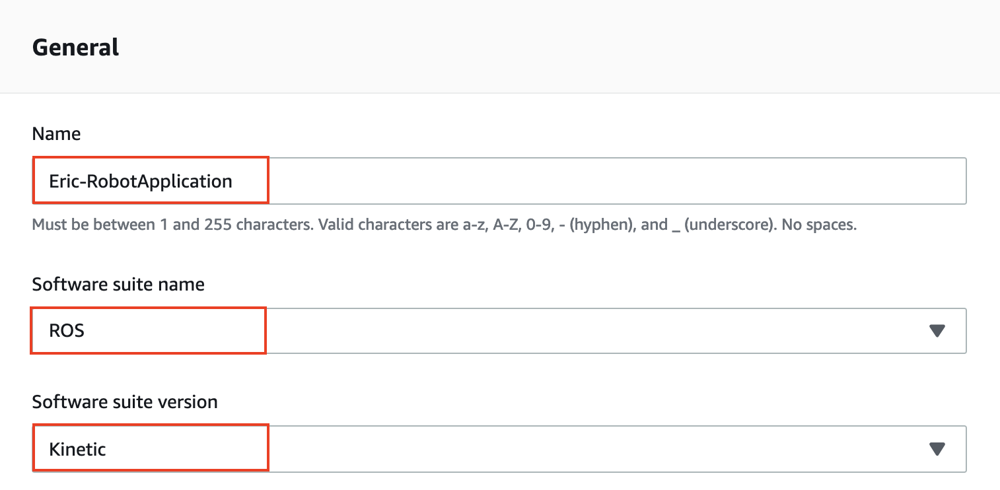

# **AWS RoboMaker**

## **Overview**

The field of robotics has gained attention gradually in recent years. Robots are known to perform tasks automatically without much human intervention, except for initial programming and instruction set being provided to them. Robots need instructions to accomplish tasks, and these instructions come in the form of applications that developers code to determine how the robot will behave. Receiving and processing sensor data, controlling actuators for movement, and performing a specific task are all functions that are typically automated by these intelligent robotics applications.

ROS is an open-source, meta-operating system for your robot. It provides the services you would expect from an operating system, including hardware abstraction, low-level device control, implementation of commonly-used functionality, message-passing between processes, and package management. It also provides tools and libraries for obtaining, building, writing, and running code across multiple computers. ROS is similar in some respects to "robot frameworks".

AWS RoboMaker is a service that makes it easy to develop, test, and deploy intelligent robotics applications at scale. RoboMaker extends the most widely used open-source robotics software framework, Robot Operating System (ROS), with connectivity to cloud services. This includes AWS machine learning services, monitoring services, and analytics services that enable a robot to stream data, navigate, communicate, comprehend, and learn. RoboMaker provides a robotics development environment for application development, a robotics simulation service to accelerate application testing, and a robotics fleet management service for remote application deployment, update, and management.

## **Scenario**

In this lab, will create a robot application and simulate application to explore a robot that navigates between goal locations and recognizes faces in photos in a simulated home. We use **Cloud9** to develop the robotic application and simulation environment. After the development is complete, packaged it into **S3**. The robot will use the **Kinesis Video Stream** to transfer the virtual video to AWS Cloud, use **Rekognition** to identify the face in the video stream, and finally use **Kinesis Data Stream** to return it to the robot. While robot receive the identified result, it will be show in terminal.

<p align="center">
    
</p>

## **Step by step**

### **Upload photos to S3 bucket**

Create **S3** Bucket that can be store face images, robot application package, robot simulation package and the log information from robot.

- On the **Service** menu, choose **S3**. Select **Create Bucket**.

- For Bucket Name, type **Unique Name**. You can name it yourself.

- For Region, select **US.East(N.Virginia)**.

- Choose button **Create**.

<p align="center">
    
</p>

- Select the bucket which you created before, and upload **photos** folder.

### **Create kinesis data streams and video streams**

Create **Kinesis Video Stream** to tranfer robot video stream. The video stream contains the facial image that will be recognized. The result will be retured to robot through **Kinesis Data Stream**. You will learn how to create **Rekognize stream processor** in the next section.

- On **Services** menu, choose **Kinesis**.

- On the left dashboard, choose **Data Streams**.

- Choose **Create Kinesis stream**.

- For **Kinesis stream name**, type your stream name. You can name it yourself.

- For **Number of shards**, type `1`.

<p align="center">
    
</p>

- Choose **Create Kinesis stream**.

- Choose **Kinesis Data Stream** you created.

<p align="center">
    
</p>

- Copy **Stream ARN** to your textbook.

<p align="center">
    
</p>

- On the left dashboard, choose **Video Streams**.

- Choose **Create**.

- For **Stream name**, type stream name. You can name it yourself.

- Check **Use default settings**.

<p align="center">
    
</p>

- Choose **Create stream**.

- In the **Stream info** section, copy **Stream ARN** to your textbook.

<p align="center">
    
</p>

### **Build face collection and stream processor**

Build face collection and stream processor with Lambda.

- On **Service** menu, choose **Lambda**. Select **Create Function**.

- Choose **Author from scratch**.

- For **Name**, type function name. You can name it yourself.

- For **Runtime**, select **Python 3.6**.

- For **Role**, select **Create a custom role**.

- For **IAM Role**, choose **Create a new IAM Role**.

- For **Role Name**, type the role name. You can name it yourself.

<p align="center">
    
</p>

- Choose **View Policy Document**.

- Choose **Edit** and choose **Ok**.

<p align="center">
    
</p>

- Paste following policy in the console, and replace string `<YOUR_BUCKET_NAME>` with bucket name you created in previous step.

```
{
    "Version": "2012-10-17",
    "Statement": [
        {
            "Sid": "VisualEditor0",
            "Effect": "Allow",
            "Action": [
                "rekognition:CreateStreamProcessor",
                "s3:GetObject",
                "rekognition:ListCollections",
                "iam:PassRole",
                "rekognition:CreateCollection",
                "logs:CreateLogStream",
                "rekognition:IndexFaces",
                "rekognition:ListStreamProcessors",
                "s3:ListBucket",
                "logs:PutLogEvents",
                "rekognition:ListFaces"
            ],
            "Resource": [
                "arn:aws:s3:::<YOUR_BUCKET_NAME>/*",
                "arn:aws:s3:::<YOUR_BUCKET_NAME>",
                "arn:aws:iam::*:role/*",
                "arn:aws:rekognition:*:*:collection/*",
                "arn:aws:rekognition:*:*:streamprocessor/*",
                "arn:aws:logs:us-east-1:<Account number>:*"
            ]
        },
        {
            "Sid": "VisualEditor1",
            "Effect": "Allow",
            "Action": [
                "s3:ListAllMyBuckets",
                "s3:HeadBucket"
            ],
            "Resource": [
                "arn:aws:s3::::::<YOUR_BUCKET_NAME>/*",
                "arn:aws:s3::::::<YOUR_BUCKET_NAME>"
            ]
        },
        {
            "Sid": "VisualEditor2",
            "Effect": "Allow",
            "Action": "logs:CreateLogGroup",
            "Resource": "*"
        }
    ]
}
```

- Choose **Allow**.

- Back to Lambda Function, then choose **Create function**.

- On **Service** menu, choose **IAM**.

- In the left dashboard, choose **Roles**.

- Choose **Create role**.

- In the section **Choose the service that will use this role**, choose **Rokognition**.

<p align="center">
    
</p>

- Choose **Next: Permissions**, then choose **Next: Tags**.

- In **Add tags**:

    - For **Key**: `Owner`.

    - For **Value**, `<YOUR_NAME>`.

- Choose **Next: Review**.

- For **Role name**, you can name it yourself.

- Choose **Create role**.

- In **Search** field, type role name you created and select it.

<p align="center">
    
</p>

- Copy the **Role ARN** to your textbook.

<p align="center">
    
</p>

- Back to **Lamda Function**.

- Paste the code to the **Function code** section and replace the following string:

    - `<YOUR_BUCKET_NAME>`: Bucket name you created.

    - `<YOUR_COLLECTION>`: Collection name, you can name it yourself.

    - `<YOUR_VIDEO_STREAM_ARN>`: Kinesis video stream arn, you copied in the previous step.

    -  `<YOUR_DATA_STREAM_ARN>`: Kinesis data stream arn, you copied in the previous step.

    - `<YOUR_ROLE_ARN>`: IAM role arn for **Rekognition**, you copied in the previous step.

```
import boto3

def lambda_handler(event, context):

    s3 = boto3.resource('s3')
    rekognition = boto3.client('rekognition')
    
    # The bucket store faces.
    bucket_name = '<YOUR_BUCKET_NAME>'
    bucket = s3.Bucket(bucket_name)
    # All of the faces image in the 'photos' folder.
    objs = bucket.objects.filter(Prefix = 'photos')
    
    # Create rekognition collection if not exist.
    collection_name = '<YOUR_COLLECTION>'
    collection_list = rekognition.list_collections()
    if collection_name not in collection_list['CollectionIds']:
        response = rekognition.create_collection(
            CollectionId = collection_name
        )

    # Retrieve each photo.
    for obj in objs:
        # Get file extension.
        file_extension = obj.key.split('.')[-1]
        # Get face name
        face_name = obj.key.split('/')[-1].split('.')[0]
        
        # Check file extension.
        if file_extension in ['jpg', 'jpeg', 'png']:
            
            # Build index face in collection.
            rekognition.index_faces(
                CollectionId = collection_name,
                Image = {
                    'S3Object': {
                        'Bucket': bucket_name,
                        'Name': obj.key
                    }
                },
                ExternalImageId = face_name,
                DetectionAttributes = ['ALL']
            )
    
    # List all of face.
    face_list = rekognition.list_faces(
        CollectionId = collection_name,
        MaxResults = 123
    )
    print(face_list)
    
    # ---------Create stream processor
    response = rekognition.create_stream_processor(
        Input = {
            'KinesisVideoStream':{
                'Arn': '<YOUR_VIDEO_STREAM_ARN>'
            }
        },
        Output={
            'KinesisDataStream': {
                'Arn': '<YOUR_DATA_STREAM_ARN>'
            }
        },
        Name='RobomakerProcessor',
        Settings={
            'FaceSearch': {
                'CollectionId': collection_name,
                'FaceMatchThreshold': 70.0
            }
        },
        RoleArn='<YOUR_ROLE_ARN>'
    )
    print(response)
```

> In the above code, you create a rekognition collection to store facial information, kinesis video stream for transfer video stream from robot and data stream to transfer the rekognition result to robot.

- In the **Basic settings** section, change timeout to `3 minutes`.

- Choose **Save**, and then select **Test**.

- For **Event name**, type **Execute**.

- Choose **Create**, and then select **Test** again.

### **Robot development environment**

You will create robot development environment using **Cloud9**. In this environment, you can develop robot application and simulation. Finally, build and bundle your robot workspace.

- On **Services** menu, choose **RoboMaker**.

- In the left dashboard, choose **Development environments**.

- Choose button **Create environment**.

- In **General** page:

    - For **Name**: you can name it yourself.

    - For **Instance type**: choose **m4.large**.

    - For **VPC**: choose your VPC

    - For **Subnets**: choose your subnet.

<p align="center">
    
</p>

> If you don't have any VPC, please create it first.

- Choose **Create**.

- Choose **Open Environment**.

- Wait for a while, your environment will be creating and connecting.

- Choose **RoboMaker Resources**, and then choose **Navigation and Person Rekognition**.

<p align="center">
    
</p>

> The source code of **Navigation and Person Rekognition** is prepared by official, including robot application and simulation environment.

- The source code of navigation and rekognition will be download, please wait for a while. When the source code is downloaded, you will see the message as below.

<p align="center">
    
</p>

- On the left foder search bar, type `kinesis.launch`.

- Choose the first result.

<p align="center">
    
</p>

- Paste the following code. Please replace `<YOUR_KINESIS_DATA_STREAM>` with your data stream name and replace `<YOUR_KINESIS_VIDEO_STREAM>` with your video stream name. Both stream we created in the previous step.

```
<launch>
  <!-- AWS region with default -->
  <arg name="aws_region" value="$(optenv ROS_AWS_REGION us-west-2)" doc="AWS region override, defaults to us-west-2 if unset"/>

  <!-- Optional launch ID, if specified, used for suffixing resource names -->
  <arg name="launch_id" value="$(optenv LAUNCH_ID)" doc="Used for resource name suffix if specified"/>

  <!-- The following allows for parameterization and defaulting to config -->
  <arg name="stream_name" default="<YOUR_KINESIS_VIDEO_STREAM>" />
  <arg name="rekognition_data_stream" default="A<YOUR_KINESIS_DATA_STREAM>" />

  <!-- If a stream config file argument is provided by the caller then we will load it into the node's namespace -->
  <arg name="stream_config" default="$(find person_detection_robot)/config/kvs_config.yaml" />

  <!-- Overwrites the image topic from config file if provided -->
  <arg name="image_topic" default="" />

  <!-- Helper arguments used in multiple places, and not intended to be specified -->
  <arg name="node_name" default="kinesis_video_streamer" />
  <arg name="node_namespace" default="kinesis_video/stream0" />
  <arg name="param_prefix" default="$(arg node_name)/$(arg node_namespace)" />

 <!--Launch encoder node for kinesis video stream-->
  <node pkg="h264_video_encoder" type="h264_video_encoder" name="h264_video_encoder">
    <rosparam command="load" file="$(find person_detection_robot)/config/h264_encoder_config.yaml"/>
    <param name="image_transport" value="raw"/>
    <rosparam if="$(eval image_topic != '')" param="/$(arg param_prefix)/subscription_topic" subst_value="true">$(arg image_topic)</rosparam>
  </node>

  <node name="$(arg node_name)" pkg="kinesis_video_streamer" type="kinesis_video_streamer">
    <param name="aws_client_configuration/region" value="$(arg aws_region)" />
    <param name="kinesis_video/log4cplus_config" value="$(find kinesis_video_streamer)/kvs_log_configuration" />
    <param name="kinesis_video/stream_count" value="1" />
    <rosparam if="$(eval stream_config!='')" command="load" file="$(arg stream_config)" ns="$(arg node_namespace)" />
    <rosparam param="/$(arg param_prefix)/rekognition_data_stream" subst_value="true">$(arg rekognition_data_stream)</rosparam>
    <rosparam param="/$(arg param_prefix)/stream_name" subst_value="true">$(arg stream_name)</rosparam>
  </node>
</launch>
```

- Save file.

- Choose **RoboMaker Run**, and then select **Build**. Finally, choose **Person Detection Robot**.

<p align="center">
    
</p>

> Wait for a while, your robot application is being build. After build is complete, you will see the message of **Update succeeded**.

- Choose **RoboMaker Run**, and then select **Build**. Finally, choose **PersonDetection Simulation**.

<p align="center">
    
</p>

> Wait for a while, your robot simulation is being build. After build is complete, you will see the message of **Update succeeded**.

- Choose **RoboMaker Run**, and then select **Bundle**. Finally, choose **PersonDetection Robot**.

<p align="center">
    
</p>

> Wait for a while, your robot application is being bundle. After bundle is completed, you will see the message of **Update succeeded**. Under the path **~/PersonDetection/robot_ws/bundle**, the application bundle result **output.tar.gz** was created.

- Choose **RoboMaker Run**, and then select **Bundle**. Finally, choose **PersonDetection Simulation**.

<p align="center">
    
</p>

> Wait for a while, your robot simulation is being bundle. After bundle is complete, you will see the message of **Update succeeded**. Under the path **~/PersonDetection/simulation_ws/bundle**, the simulation bundle result **output.tar.gz** was created.

- Now that your robot development is complete. You will upload the file output.tar.gz to **S3**.

- Paste the following command to **Cloud9** terminal. Please replace `<YOUR_BUCKET_NAME>` with your bucket name you created in the previous step.

```
$ aws s3 cp ~/environment/PersonDetection/robot_ws/bundle/output.tar.gz s3://<YOUR_BUCKET_NAME>/outputApplication.tar.gz

$ aws s3 cp ~/environment/PersonDetection/simulation_ws/bundle/output.tar.gz s3://<YOUR_BUCKET_NAME>/outputSimulation.tar.gz
```

> These command will rename your application and simulation output.tar.gz file respectively. Finally, upload it to **S3**.

- Now that your robot development is complete. All the results are packaged and passed to **S3**.

### **Create IAM Role for RoboMaker**

- On **Services** menu, choose **IAM**.

- In the left dashboard, choose **Roles** and then choose **Create role**.

- Choose **EC2**, and then select **Next: Permission**.

<p align="center">
    
</p>

- Choose **Create policy**.

<p align="center">
    
</p>

- Choose **JSON** tab.

<p align="center">
    
</p>

- Paste the following IAM policy. Please replace `<YOUR_BUCKET_NAME>` with your bucket name which you created in the previous step.

```
{
    "Version": "2012-10-17",
    "Statement": [
        {
            "Sid": "VisualEditor0",
            "Effect": "Allow",
            "Action": [
                "polly:SynthesizeSpeech",
                "ec2:DeleteSubnet",
                "cloudwatch:PutMetricData",
                "logs:DescribeLogStreams",
                "ec2:DeleteNetworkInterface",
                "kinesis:GetShardIterator",
                "kinesisvideo:GetDataEndpoint",
                "logs:PutLogEvents",
                "ec2:DescribeSecurityGroups",
                "ec2:AssociateRouteTable",
                "kinesisvideo:PutMedia",
                "logs:CreateLogStream",
                "ec2:DescribeNetworkInterfaces",
                "ec2:CreateNetworkInterfacePermission",
                "ec2:DescribeVpcs",
                "kinesis:GetRecords",
                "ec2:CreateSubnet",
                "ec2:DescribeSubnets",
                "kinesisvideo:DescribeStream",
                "kinesisvideo:TagStream"
            ],
            "Resource": "*"
        },
        {
            "Sid": "VisualEditor1",
            "Effect": "Allow",
            "Action": [
                "s3:Get*",
                "s3:List*",
                "s3:Put*"
            ],
            "Resource": "arn:aws:s3:::<YOUR_BUCKET_NAME>/*"
        },
        {
            "Sid": "VisualEditor2",
            "Effect": "Allow",
            "Action": "logs:CreateLogGroup",
            "Resource": "*"
        },
        {
            "Sid": "VisualEditor3",
            "Effect": "Allow",
            "Action": "kinesis:ListShards",
            "Resource": "*"
        }
    ]
}
```

- Choose **Review Policy**

- For **Name**, type role name as `<YOUR_NAME>-RoboMakerPolicy`. Replace <YOUR_NAME> with your English name, 
and then choose **Create policy**.

- Back to **Create Role** page, choose IAM policy you created.

<p align="center">
    
</p>

- Choose **Next: Tags**.

- On page **Add tags**:

    - For **Key**: `Owner`

    - For **Value**: `<YOUR_NAME>`

- Choose **Next Review**.

- For Role name, type `<YOUR_NAME>-RoboMakerRole`.

- Choose **Create role**.

- Select IAM role created.

<p align="center">
    
</p>

- Choose **Trust relationships** tab, and then selct **Edit trust relationship**.

<p align="center">
    
</p>

- Modify **Policy Document** as below.

<p align="center">
    
</p>

- Choose **Update Trust Policy**.

### **Create robot applications**

You will create a robot appliction to perform the task you defined.

- On **Service** menu, choose **RoboMaker**.

- On the left dashboard, choose **Robot applications**.

- Choose **Create robot application**.

<p align="center">
    
</p>

- In **General** section:

    - For **Name**: `<YOUR_NAME>-RobotApplication`, please replace <YOUR_NAME> with your English name.

    - For **Software suite name**: choose **ROS**.

    - For **Software suite version**: choose **Kinetic**.

    <p align="center">
    
    </p>

- In **Source** section:

    - For **X86_64 source file**: `s3://<YOUR_BUCKET_NAME>/outputApplication.tar.gz`,  please replace <YOUR_BUCKET_NAME> with your bucket name your created in the previous step.

<p align="center">
    
</p>

- Choose **Create**.

### **Create simulation applications**

You will create a simulation application to simulate the robot environment.

- On **Service** menu, choose **RoboMaker**.

- On the left dashboard, choose **Simulation applications**.

- Choose **Create simulation application**.

<p align="center">
    
</p>

- In **General** section:

     - For **Name**: `<YOUR_NAME>-RobotSimulation`

     - For **Software suite name**: choose **Gazebo**.

     - For **Software suite version**: choose **7**.

     - For **Rendering engine name**: choose **OGRE**.

     - For **Rendering engine version**: choose **1.x**.
     
    <p align="center">
    
    </p>

- In **Sources** section:

    - For **X86_64 source file**: `s3://<YOUR_BUCKET_NAME>/outputSimulation.tar.gz`, please replace <YOUR_BUCKET_NAME> with your English name.

    <p align="center">
    
    </p>  

- Choose **Create**.

### **Start simulate job**

In this section, you will start robot simulate job base on the output.tar.gz which you uploaded to **S3** in the previoud step.

- On **Services** menu, choose **RoboMaker**.

- On the left dashoboard, choose **Simulation jobs**.

- Choose **Create simulation job**.

<p align="center">
    
</p>

- In **Simulation job details** section:

    - For **Simulation job duration**: `1 Hours`
    
    - For **Failure behavior**: `fail`

    - For **IAM role**: choose `<YOUR_NAME>-RoboMakerRole`.

    <p align="center">
    
</p>

- In **Output destination** section:

    - Choose link **Create new S3 folder**.

    - Select your **S3** bucket.

    - Choose **Create folder** and type: `output`

    - Choose **Save**.

     <p align="center">
    
    </p>

    - Back to **RoboMaker** console. For **Simulation job output**, type `s3://<YOUR_BUCKET_NAME>/output`

<p align="center">
    
</p>

- Choose **Next**.

- In **Robot application**:

    - Check **Choose existing application**.

    - For **Robot application**, choose your robot application you created in the previous step.

    - For **Robot application version**, choose **$LATEST**.

    <p align="center">
    
    </p>

- In **Robot application configuration**:

    - For **Launch package name**, type `person_detection_robot`

    - For **Launch file**, type `person_detection.launch`

    <p align="center">
    
    </p>

- In **Environment variables** section:

    - For **Key**: `ROS_AWS_ROGION`

    - For **Value**: `us-east-1`

    <p align="center">
    
    </p>

- Choose **Next**.

- In **Simulation application** section:

    - Check **Choose existing application**.

    - For **Simulation application**, choose your robot simulation you created in the previous step.

    - For **Simulation application version**, choose **$LATEST**.

    <p align="center">
    
    </p>

- For **Simulation application configuration**:

    - For **Launch package name**: `person_detection_simulation`

    - For **Launch file**: `small_house_turtlebot_navigation.launch`

    <p align="center">
    
    </p>

- In **Environment variables** section:

    - For **Key**: `ROS_AWS_ROGION`

    - For **Value**: `us-east-1`

    - Choose **Add environment variable**.

    - For **Key**: `TURTLEBOT3_MODEL`

    - For **Value**: `waffle_pi`

    <p align="center">
    
    </p>

- Choose **Next**.

- Choose **Create**.

## **View the simulation job**

Finally, we will see the result of this lab.

- Choose the simulation job which you created.

<p align="center">
    
</p>

> Please wait for a while. When the status changes from preparing to running, the environment is ready.

- Once the simulation job is ready, you will see the following screen.

<p align="center">
    
</p>

- Choose **Gazebo**. You will see the simulation environment in small house.

<p align="center">
    
</p>

- Back to the simulation job console.

- Choose **rqt**. In the upper left, select **Plugins** and then select **Visualization**. Finally, choose **Image View**

<p align="center">
    
</p>

- In the select menu, choose **camera/rgb/image_raw**.

<p align="center">
    
</p>

- You will see the simulate video from the camera which installed on the robot.

<p align="center">
    
</p>

- Back to simulation job, choose **Terminal**.

- In terminal, type `rostopic echo /rekognized_people`.

- Once the person's photo in video, you will see the screen similar to the following.

<p align="center">
    
</p>

> The person name is from **Rekognition**.

## **Conclusion**

Congratulations! You learned how to develop your robot in AWS Cloud. 

- Connect **Recognition** service to robot.

- Package robot application and simulation application to **S3** and use it to start a simulation job.

- Transfer live video streams from a robot to **Rekognition** using Kinesis.

- Transfer **Rekognition** result live data streams to robot.

## **Cleanup**

- Delete **Lambda Function**.

- Delete **Kinesis Video Stream**.

- Delete **Kinesis Data Stream**.

- Delete **S3 Bucket**.

- Delete **EC2** instance from **Cloud9**.

- Delete **IAM** Role and Policy.

- In the **Action** menu, choose **Cancel** to cancel simulation job.

<p align="center">
    
</p>